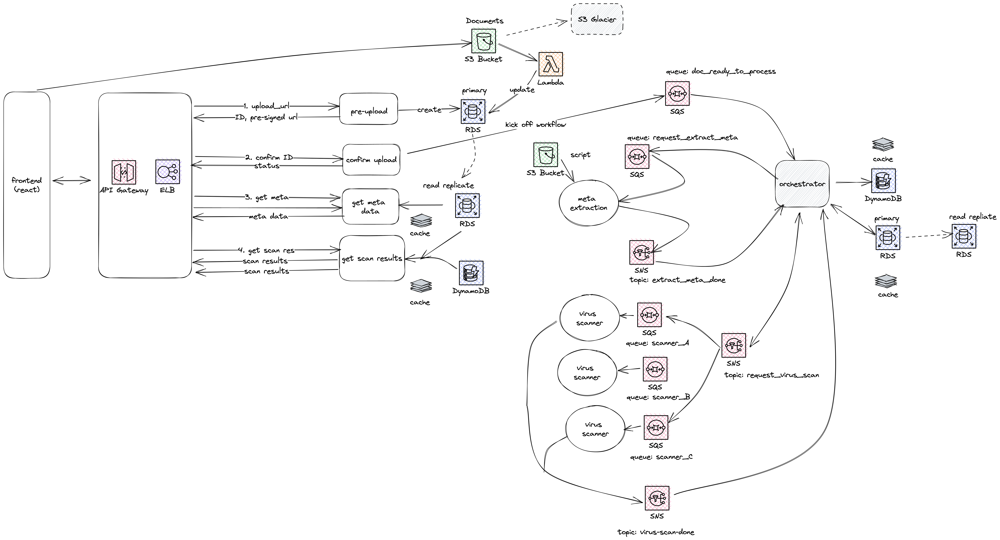
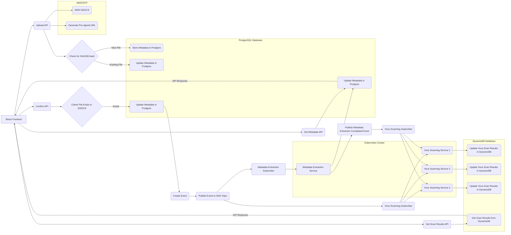

# IntelliDox A File Proecssing System

This is the POC of Intellidox, for users to upload and process files, for example scan virus.

## Functions

1. user upload files
2. user confirm upload
3. user get virus scan results

## System Design



[More detail of the sytem design](document/design.md)

## Diagram



### Frontend: A React app for uploading files and displaying results.
    
    Uploads files directly to S3 using pre-signed URLs.
    Calls the API to confirm the upload and start processing.

### API: RESTful API, web services deployed to EKS
    
    Handles file upload requests and generates pre-signed URLs.
    Handles "confirm" requests and adds messages to the MetadataExtractionQueue.
    Provides document meta data and scan results to clients

### S3: Stores the uploaded files.

### Lambda: Generates pre-signed URLs for S3 uploads.

### EKS Cluster: Contains the following microservices and components:
    
    1. Metadata-extraction service: Extracts metadata from the files.
        Listens to the MetadataExtractionQueue.
        Publishes messages to the MetadataExtractionCompleted SNS topic when the task is completed.
    2. Virus scanner services: Multiple virus scanner pods from different vendors.
        Each pod listens to its own SQS queue (e.g., VirusScannerQueue_A, VirusScannerQueue_B, etc.).
        Each pod's SQS queue is subscribed to the VirusScanningRequested SNS topic.
        Publishes messages to the VirusScanningCompleted SNS topic when the task is completed.
### SNS topics:
    
    1. MetadataExtractionCompleted: Notifies subscribers when the metadata extraction is done.
    2. VirusScanningRequested: Distributes virus scanning tasks to multiple scanner pods.
    3. VirusScanningCompleted: Notifies subscribers when the virus scanning is done.
### SQS queues:
    
    1. MetadataExtractionQueue: Holds tasks for the metadata-extraction service.
    2. VirusScannerQueue_A, VirusScannerQueue_B, etc.: Holds tasks for each virus scanner pod.

### RDS PostgreSQL: Stores file metadata.

### DynamoDB: Stores virus scanning results.

### Monitoring: Datadog for monitoring and alerting.

## What I Don't Like ...

The above design provides great efficiency, scalability, and resilience as an event-driven model using dedicated services like SQS and SNS, except one problem:

`it makes local development and testing hard`

Can we achieve same benefit without SQS, SNS, queue or event broker? There are at least below options

1. Kubernates API and Jobs. K8s support job management, we can call its API to schedule and run jobs.
2. RDS (Postgres). Create jobs table, and have services poll the jobs.
3. Redis. It has support of queue and pub/sub too.

Considering Redis is used widely for caching, and easy to install at local with Docker, we can choose to abstract the "job management" layer, to use Redis for local development and testing, and SQS/SNS for other environments.

### Redis vs SQS/SNS

We can create an abstraction layer to manage events or jobs, making it easier to switch between different implementations like Redis, SQS, and SNS, depending on the environment. This abstraction can be achieved by using the Strategy pattern or by implementing a custom interface for event management.

````Go
type EventManager interface {
	Publish(topic string, message interface{}) error
	Subscribe(topic string, handler func(message interface{})) error
	Enqueue(queue string, message interface{}) error
	Dequeue(queue string, handler func(message interface{})) error
}
````

## ServiceWeaver

In reality, often we start with one single project codebase, and eventually start to introduce more "micro-services" along with organization structure mirroring them, for example, in a year or two, we may see multiple engineering teams maintaining even more services:

* Prodcut enginering: React and user experiences 
* API: web service
* Platform engineering: document service, virus scan service

And we connect the services through

* Queue
* Restful API
* gRPC

With micro-service, we achieve the "do one thing and do it well", however, when a bunch of things all loosed coupled together, we get more chaos, and start to miss the benefit of single binary or codebase.

[The ServiceWeaver Framework](https://serviceweaver.dev/) may help us

`Write your application as a modular binary. Deploy it as a set of microservices`

it seems it tries to abstract the "R" (remote) in the gRPC call so we can run direct procedure call at local, and gRPC call on production.

## Experiments

In this project, we will experiment

1. abstraction to use Redis for local job management
2. use ServiceWeaver to abstract the gRPC