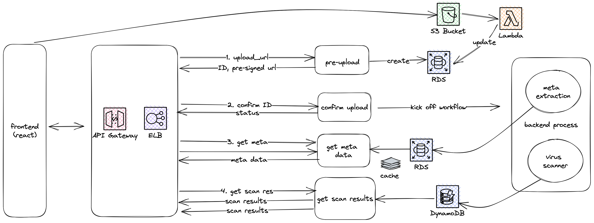
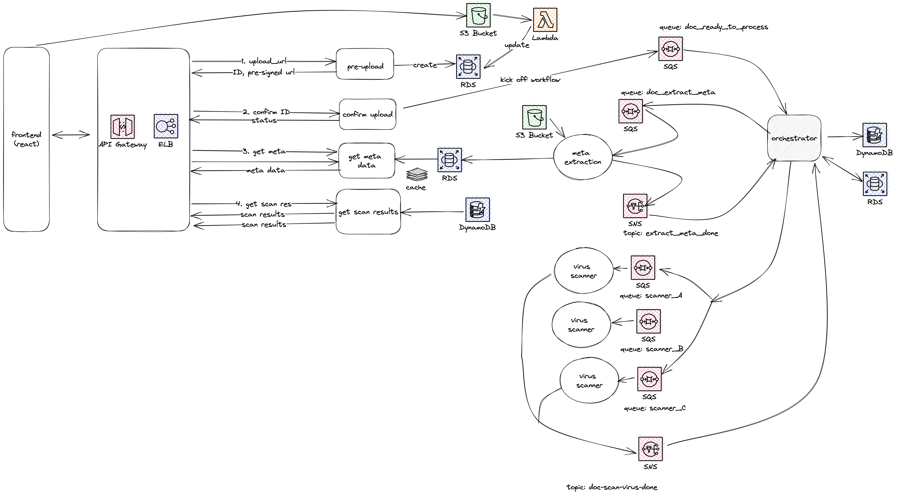
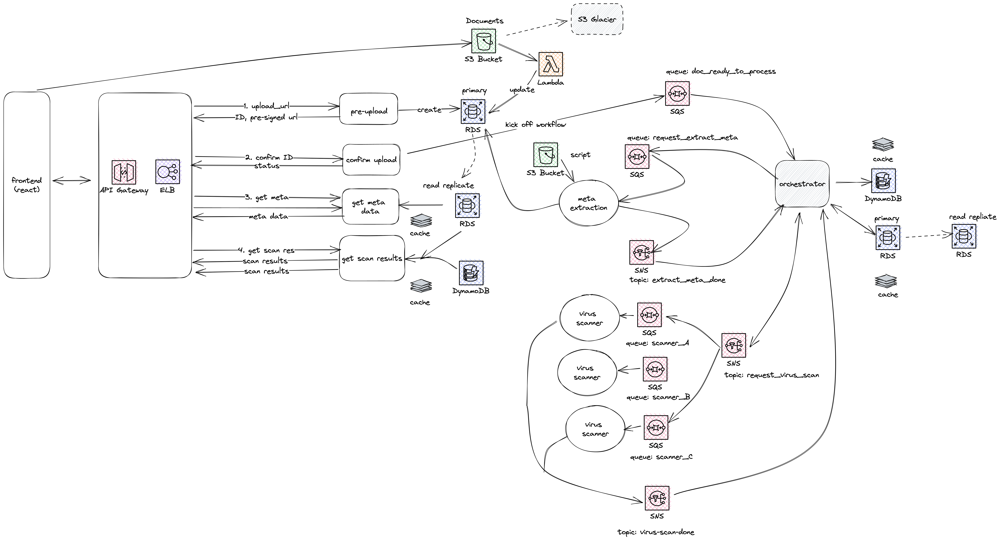

# System Design of IntelliDox


## Requirements

### Basic Use Case
1. user can upload file (size up to 1G)
2. user confirm uploading
3. user can see meta data, including file name, size
4. user can get scan status

### basic attribute
1. name
2. file type: PDF, etc
3. size

### meta data

* We will have script to extract the meta data of the uploaded file. It is assumly quick task. 
* meta data are key-value pairs.
* The team wants to be able to update the script quickly withought going through formal deployment/release process.

### scan results

* we will use many (tens of) scanners from different vendors, available on different OS (Linux, Windows). 
* we run the scanners to scan the uploaded file
* present to suer the results from each scanner, including
    1. scanner name
    2. scanner results, for example, "not dected", or whatever messages
* Since we are running many scanners, some are quick, some are slow. User will see the latest results added to the page. The whole process will take 10-20 seconds to finish.

### non-functional requirements

1. Expect to have millions of documents uploaded per day
2. File size up to 1G. 
3. Display meta data and status quickly, for example in 500 million seconds
4. Present scan results to user in less than X seconds.
5. team can update the extractor script without deployment process
6. The documents will be stored forever.


## Design Approach

1. First, we identify the pattern of the problem domain - for example, a document upload-process flow. A well understood pattern is to leverage async task/job workflow to achieve high throughput.

We will apply some common practices to establish a baseline design, starting from logic model, breaking down to multple components, then zoom in and make decisions or suggestions on the architecture. 

2. Once we have a working design, we want to improve it by
    * scalability
    * availability
    * performance
    * monitoring/observability
    * cost
3. Finally we consider some special edge cases of the particular domain.

## Components 

We can start to plan our system with 3 components

1. front end - the user experiences
2. web services - to serve the web, to handle upload, confirm and present the meta data and scan results.
3. backend tasks or jobs - services to extrac meta data, and scan virus, then store results.
4. Data storage
    * database
    * file storage


We decide this sytem will run in cloud (AWS, or GCD or Azure). Below we will use AWS as example, but the solution will work for other cloud service providers.

### Frontend

We assume it will be a React app. (irrelevent to our sytem design)

### File Storage S3

We can use AWS S3 to store the documents, so we can leverage its scalibility, availability and low cost.
Also:
* for old documents ( > 1 year) we can move to cold storage for example S3 Glacier
* Particularily, we can create signed URL with secured token, this way, front end can upload the file directly to S3, reducing the needs of resource at service layer.

Note: to leverage the pre-signed URL for directly uploading to S3, our React App will follow below steps

1. call our API, and get the pre-signed URL
2. upload file to the pre-signed URL

### Data and Database

below are the basic attributes a document has. 

Note: the SHA256 hash is to check duplicated file. For example, if a user upload the same file again, we can locate the results without re-scanning the file.

| Column Name	| Data Type	| Description
| --------------- | -------------- | -------------- |
| id	| UUID	| Unique identifier for the file record
| file_name	| VARCHAR	| Original file name
| file_size	| BIGINT	| File size in bytes
| file_type	| VARCHAR	| File type (e.g., PDF)
| sha256	| CHAR(64)	| SHA-256 hash of the file content
| create_at	| TIMESTAMP	| record creation time
| uploaded_at | TIMESTAMP | doc uploaded time
| updated_at | TIMESTAMP | record updated time
| process_status | VARCHAR | the status of the process, can be requested, uploaded, in progress, etc
| meta_data | JSONB | the meta data, in JSON

Each scan result have name and result text

| Column Name	| Data Type	| Description
| --------------- | -------------- | -------------- |
| id	| UUID	| Unique identifier for the scan result record
| file_id	| UUID	| Foreign key referencing the files table
| scanner_name	| VARCHAR	| Name of the virus scanner
| scan_result	| VARCHAR	| Scan result text (e.g., "undetected" or issue description)
| start_at | TIMESTAMP | the time when scanner starts scanning the doc
| end_at | TIMESTAMP | the time when scanning is finished

Now let's do a quick estimate of the size of data. The doc meta data appears to be small enough, say 1K. However, the scan results may have bigger size since we will have many scanners. Also, we are handling millions of file evey day, and store the files permanently, even in 10 years, the volume will be huge.

If each record takes 10 KB of storage, we can calculate the total storage required for different time frames:

Daily storage: 1 million files * 10 KB/file = 10,000 MB (approximately 9.77 GB)
Yearly storage: 300 million files * 10 KB/file = 3,000,000 MB (approximately 2,930 GB or 2.86 TB)
10-year storage: 3,000 million files * 10 KB/file = 30,000,000 MB (approximately 29,296 GB or 28.6 TB)

Two groups of databases that we can choose from:
1. relational database (AWS RDS, Postgres), best for structural data, ACID compliance, strong feature set (support JSONB), existing SQL tools.
1. Non-SQL (MongoDb, DynamoDB etc). horizonal scale, flxibible schema, write heavy operations.

Suggestions to get best from both:

1. RDS (Postgres, Aurora) for document attributes and meta data in JSONB
2. NonSQL (DynamoDB, MongoDB) for scan results.

Note: relationship database support partition too, for example, we can partition document table by age, to improve scalability and performance.


### Front End and Web Services 

Now we can update our front end and web services diagram




In the updated version, we have

1. API gateway, which support API Key for authentication, Rate limit, and caching.
2. ELB load balancer to load balance requests.
3. Web services. We can deploy them to EKS, to leverage the container orchistration, autoscaling and all the goodies from K8s
4. We can use Restful API for the web services. Note, to continuously deliver scan results to clients, there are more than one choices. 
    * Server to "push" (websockets, sse etc)
    * Client to "pull" by usual HTTP API. 
    
Here we suggest to use HTTP API, since this use case is not much conversational, like game or chat room. Developers are more familiar with Restful API too. We will mitigate concerns of throughput by caching, and autoscaling.

5. Our web services have 4 endpoints

    * /docs/request-upload
    * /docs/{uuid}/confirm-upload
    * /docs/{uuid}/meta
    * /docs/{uuid}/scan-results

6. A Lambda function, triggered by the S3 event when a file is uploaded, to update the Document status to "uploaded", and "upload_time"

### API Endpoints

1.  POST /docs/request-upload

    Request has file name
    ````JSON
    {
        "file_name": "abc.pdf"
    }
    ````

    Note: Talk with React dev to understand whether they can get the file name and size before making above request.
    The service will generate a pre-signed S3 url, create a new record in the Document table, and return the ID (UUID)

    In S3, we can use Year (YYYY) or Year-Month (YYYYMM) as bucket name, this way we can move older buckets to code storage.

    We can use the document id/UUID as object name in S3. It will help our other processes to easiy identify the document record.
    The response will be simply
    ````JSON
    {
        "id": "abcd-efgh...",
        "file_name": "https://...",
        "upload_url": "https://..."
    }
    ````
    The React App will then upload the file to the S3 bucket, and keep the document id for later requests.

    To further improve performance, we can consider generating URLs and storing them in Cache (redis) with TTL. The service can just grab URL when needed. Of course, that means we will have a backend job (Lambda) to continuously generate new URLs.

2. /docs/{uuid}/confirm-upload

    POST method, with document id in the request path

    This simply signify to our system that we can start the process now.

    we will return the basic document attributes, status ("in-progress")
    ````JSON
    {
        "id": "abcd-efgh...",
        "file_name": "",
        "status": "in progress",
    }
    ````
    We may consider including the API urls in the response, for example
    ````JSON
    {
        "urls": {
            "document": "https:/..../docs/abcd-efgh...",
            "meta-data": "https:/..../docs/abcd-efgh.../meta",
            "scan-results": "https:/..../docs/abcd-efgh.../scan-results",
        }
    }
    ````
    It gives the backend the flexibility to control the URLsm, maybe useful in some unforseen circumstances, but also adds a little complexity at front-end.

3. /docs/{uuid}/meta

    GET the docment meta data.

    The service will return document basic attributes, plus the meta data like
    ````JSON
    {
        "id": "abcd-efgh...",
        "file_name": "",
        "status": "in progress",
        "meta": {
            //JSON
        }
    }
    ````
4. /docs/{uuid}/scan-results

    GET the docment scan results data.

    The service will return document basic attributes, plus the scan results data like

    ````JSON
    {
        "id": "abcd-efgh...",
        "file_name": "",
        "status": "in progress",
        "scan-results": []
    }
    ````

    or when there are scan finished

    ````JSON
    {
        "id": "abcd-efgh...",
        "file_name": "",
        "status": "done",
        "scan-results": [
            {
                "name": "scanner name",
                "results": "",
            }
        ]
    }
    ````

For the #3 and #4, we let front-end to "pull" data periodically, instead of "pushing". Often we choose a fixed interval like 200 ms. One consideration is to add control to the response JSON, for example

````JSON
    {
        "id": "abcd-efgh...",
        "file_name": "",
        "status": "in progress",
        "scan-results": [],
        "next": {
            "url": "https://..../scan-results", // URL for next pull
            "after": 1000, // after 1000 milliseconds
        }
    }
````

This gives the backend option to control the pulling frequency at front-end.


## Backend Tasks

Our user case is pretty simple with two tasks: meta extraction, and virus scanning. To handle the large volume of uploaded files, we need to have a solid task or job workflow.

Some of the options:

* Open source workflow projects like Apache Airflow
* Solutions provided by cloud provider, for example Step Function by AWS. 
* Async task management with queue, pub/sub pattern

Here we propose to use Queue or message broker and pub/sub pattern to coordinate tasks, for the simplicity, maturity,  and built in support from AWS, ie, SQS and SNS.

1. use SQS queue to distribute tasks to workers (meta extractor, virus scanner). Each worker type has its own queue.
2. user SNS topic to pub/sub the results after the task done
3. we will have a orchestrator to manage the flow, including sending message to task queue and subscribing to "done" topics.



This architecture is easy to understand and implement. We can achive great scalability, and flexibility too. With the orchestrator, we can have fine tuned control over the flow, this could be useful in the future. 

### The Orchestrator

It functions as the brain of the workflow:

1. Orchestrator listens to the request_to_process queue, get the UUID of the doc, put task to request_extract_meta queue, and update the process status.
2. Service meta-extraction service listen to the queue and run the task to extract meta, and publish message to extract_meta_done topic
3. Orchestrator subscribes to the extrac_meta_done topic, update RDS with the meta data, publish to request_virus_scan topic. update the process information, including status, and also store the counter (ie, 0)
4. Each virus scan services has its own SQS subscription to the request_virus_scan topic. And run scanner upon new message. And publish results to virus_scan_done topic
3. Orchestrator subscribes to the virus_scanner_done topic, update DynamoDB with the results, increase counter, update process status.


In this design, we can decouple the services from the flow logic, and have great control of the flow. The tradeoff is that orchestrator becomes the Single Point of Failure. The other option is to place the same logic in the meta-extraction and virus-scanner services. Therefore, in terms of availability, we need to choose between "distributed failure" vs "centralized failure". To minigate the risk, we will leverage K8s (EKS, GKE), even Zoo Keeper or Etcd if necessary.

None of the services (meta-extractor, virus-scanner) writes results to database, instead, they put the results in the SNS message (the SNS message size limit is large enough), this design will make the services simple enough, and also get us better control of the database writes.

## Infrastructure

We will containerize the services (API, backend services), and run them in K8S cluster (EKS, GKE).

## Improvements

Once we have a working design. Next to check the non-functional criterias to work on any improvements.

## Scalibility

* The arhiceture can scale with S3, EKS, SQS, and SNS.
* RDS: We can partition RDS by age
* S3: we can have Lambda function to move older buckets to cold storage

## Availability

* S3, DynamalDB, SQS, SNS, EKS have great availability within the same region
* RDS has replication, and backup.
* S3 has multi-region access points for failover.
* we can deploy services to two regions, and handle failover manually (ie, RDS)

## Performance

To make sure the system performs we can leverage caching

* RDS: create read replicates
* Elastic Cache or Redis: 
    In our use case, clients will pull the scan results data continously until the process is finished. We can make the Orchestrator update the Scan Results directly in cache first before updating RDS and DynamoDB, to reduce the hits to the database.
* API gateway: set up rate limit.
* API gateway: setup cache
* React: leverage front-end cache, and HTTP cache tag.
* File I/O: 
    In current design, each of the services (meta-extrator, virus-scanner) will download the file from S3 to the container. If this may become issue, we can use EFS or shared file system, mount it to the service containers. This way, we can copy the document from S3 to the shared file sytem once, and reduce the downloads from S3.

## Cost

* S3 cost is manageable, we can leveragte the less expensive cold storage (Amazon S3 Glacier) for older files.
* most of cost likely are on EKS
* The web service can check the Hash (for example SHA256) of the docuemnt, if it is already processed within certain period (last 7 days), it will display the results from database, without re-processing it.

## Monitoring

With such distributed system, we need to setup extensive monitoring. For example, we can use Datadog to monitor AWS services and also our services.

AWS Services:

    S3:

        * Bucket size (number of objects and total storage used)
        * Request rate (PUT, GET, DELETE, and other operations)
        * Latency (time taken to complete requests)
        * Error rate (4xx and 5xx errors)
    SQS:

        * Queue size (number of messages in the queue)
        * Message age (age of oldest message in the queue)
        * Number of messages sent/received/deleted
        * Latency (time taken to send/receive messages)
        * Error rate (failed SendMessage and ReceiveMessage calls)
    
    RDS (PostgreSQL):
        
        * CPU utilization, Memory usage, Storage usage
        * Connection count
        * Read and write IOPS
        * Database transaction rate
        * Query latency
        * Error rate
    
    DynamoDB:

        * Read and write capacity units
        * Consumed read and write capacity
        * Throttled read and write events
        * Latency (time taken for GetItem, PutItem, and UpdateItem operations)
        * Error rate (failed read and write requests)
EKS:

    Node-level metrics:

        * CPU usage and utilization, Memory usage and utilization, Disk usage and IOPS
        * Network throughput (inbound and outbound)
    
    Pod-level metrics:
        
        * CPU usage and limits, Memory usage and limits, Network throughput (inbound and outbound)
        * Number of restarts (to detect crash loops)
        * Pod status (Running, Pending, Failed, etc.)

Application-level metrics:

        * Request rate (for all services)
        * Error rate (HTTP 4xx and 5xx errors), available in Api Gateway
        * Request latency
        * Custom service metrics, if available (e.g., task processing time, number of processed tasks)


## Failure Handling

    Frontend:

        Implement retries with exponential backoff for API calls.

    API:

        * Add error handling and logging to track failures.
        * Use retries with exponential backoff when interacting with other services (e.g., S3, SQS, SNS).
        * Return appropriate error messages and HTTP status codes for failed requests.

    S3:

        * Use S3 bucket versioning.
        * Enable S3 object replication to another AWS region for added data durability.

    EKS Cluster:

        * Implement liveness and readiness probes for microservices to ensure that unhealthy instances are restarted.
        * Set desired number of replicas are running at all times.
        * Monitor pod logs and resource usage to identify and mitigate issues.

    SQS Queues:

        * Enable dead-letter queues to handle messages that can't be processed successfully after a specified number of attempts.
        * Monitor the number of messages in the queues and adjust the number of service instances or retries accordingly.

    SNS Topics:

        * Monitor SNS metrics, such as the number of messages published, failed deliveries, and retries.
        * Ensure subscribers have appropriate error handling and retries.

    RDS PostgreSQL and DynamoDB:

        * Enable automated backups and point-in-time recovery to protect against data loss.
        * Monitor database performance and logs to identify issues and optimize queries as needed.

    Monitoring:

        * Set up alerts in Datadog for critical issues, such as high error rates, high latency, or resource saturation.
        * Regularly review logs and metrics to identify trends and potential issues.


## Application Level Failure Handling

    * Error logging: Make sure that both services log errors and relevant information about the context of the failure. This will help with debugging and identifying any issues that need to be resolved.

    * Retry mechanism: Implement retries with exponential backoff for transient errors within the services. For example, if there's a temporary issue with a third-party library or an external service, the retry mechanism can help overcome it.

    * Dead-letter queues: Use dead-letter queues in SQS to capture messages that have failed processing after a specified number of attempts. This will allow you to investigate and fix the issues, and then re-process the failed messages.

    * Manual intervention: In some cases, manual intervention may be required to resolve issues with the files themselves (e.g., corrupted files, unsupported formats). Provide tools or procedures for your team to manually inspect and re-process failed files if necessary.

    * Monitoring and alerting: Set up monitoring and alerting for both services to detect high failure rates or other anomalies. This will help you identify issues early and take corrective action.

    * Idempotent processing: Ensure that both services are designed to be idempotent, meaning that they can be safely retried without causing duplicate processing or other side effects. This will allow you to safely re-process failed messages without worrying about unintended consequences.

    * Versioning and rollbacks: Use versioning for your service deployments, so you can easily roll back to a previous version in case of issues with a new release. This can help you quickly recover from failures caused by software bugs or configuration errors.

## Summary



    * Frontend: A React app for uploading files and displaying results.
        
        Uploads files directly to S3 using pre-signed URLs.
        
        Calls the API to confirm the upload and start processing.

    * API: RESTful API, web services deployed to EKS
        
        Handles file upload requests and generates pre-signed URLs.
        
        Handles "confirm" requests and adds messages to the MetadataExtractionQueue.

    * S3: Stores the uploaded files.

    * Lambda: Generates pre-signed URLs for S3 uploads.

    * EKS Cluster: Contains the following microservices and components:
        
        Metadata-extraction service: Extracts metadata from the files.
            
            *Listens to the MetadataExtractionQueue.
            *Publishes messages to the MetadataExtractionCompleted SNS topic when the task is completed.
        
        Virus scanner services: Multiple virus scanner pods from different vendors.
            * Each pod listens to its own SQS queue (e.g., VirusScannerQueue_A, VirusScannerQueue_B, etc.).
            * Each pod's SQS queue is subscribed to the VirusScanningRequested SNS topic.
            * Publishes messages to the VirusScanningCompleted SNS topic when the task is completed.

    SNS topics:

        * MetadataExtractionCompleted: Notifies subscribers when the metadata extraction is done.
        * VirusScanningRequested: Distributes virus scanning tasks to multiple scanner pods.
        * VirusScanningCompleted: Notifies subscribers when the virus scanning is done.

    SQS queues:

        * MetadataExtractionQueue: Holds tasks for the metadata-extraction service.
        * VirusScannerQueue_A, VirusScannerQueue_B, etc.: Holds tasks for each virus scanner pod.

    RDS PostgreSQL: Stores file metadata.

    DynamoDB: Stores virus scanning results.

    Monitoring: Datadog for monitoring and alerting.
    
## Notes

### Script Update

Grant the team responsible for the metadata extraction script access to the S3 bucket where the script is stored. They can update the script directly in the S3 bucket without going through the deployment process.

### Partition Postgres Tables by Age

````
CREATE TABLE document (
    uuid UUID NOT NULL,
    created_at TIMESTAMP NOT NULL,
    ...
) PARTITION BY RANGE (created_at);

CREATE TABLE document_metadata_2023 PARTITION OF document_metadata
    FOR VALUES FROM ('2023-01-01') TO ('2024-01-01');

CREATE TABLE document_metadata_2024 PARTITION OF document_metadata
    FOR VALUES FROM ('2024-01-01') TO ('2025-01-01');
````

### K8S Jobs

K8s supports jobs and trigger by call to Kubernates API. However, we choose the traditional SQS, SNS for the simplicity and familiarity.
