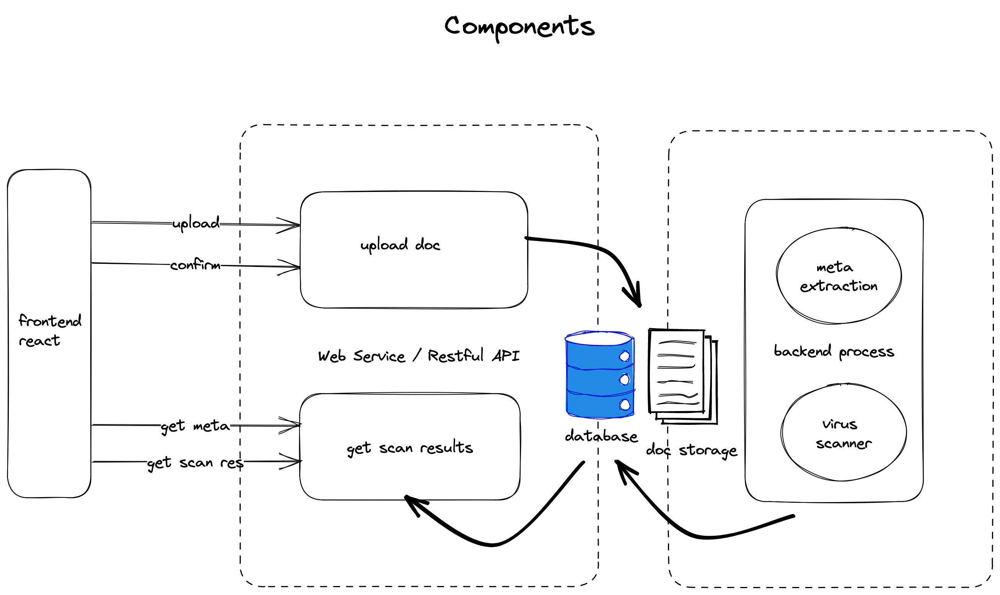

# System Design of IntelliDox

## Requirements

### Basic Use Case
1. user can upload file (size up to 1G)
2. user confirm uploading
3. user can see meta data, including file name, size
4. user can get scan status

### meta data
1. name
2. file type: PDF, etc
3. size

Note: we will run a script to extract the meta data of the uploaded file. It is assumly quick task (<200 ms). However, we want to be able to update the script quickly withought going through formal deployment/release process.

### scan results

There are many (tens of) scanners from different vendors, available on different OS (Linux, Windows). 

User will see a list of 
1. scanner name
2. scanner results, for example, "not dected", or whatever messages

Note: since we are running many scanners, some are quick, some are slow. User will see the latest results added to the page. The whole process will take seconds to finish.

### non-functional requirements

1. need to handle millions of documents per day
2. be able to handle size up to 1G. 
3. performance SLA, be able to display meta data and status in 500 million seconds
4. Scan performance expected to finish and present to user in 10 seconds.
5. team can update the extractor script without deployment process

## Design Approach

1. First, we identify the pattern of the problem domain - this is a document upload-process flow, a well understood pattern is to leverage async task/job workflow to achieve high throughput.

We will apply some common practice to establish a baseline design, starting from logic model, then zoom in each component and make decisions or suggestions on the architecture. 

2. Once we have a working design, we want to improve it to ensure

1. scalability
2. reliability
3. performance
4. monitoring/observability
5. cost

3. Last we think of special edge cases of the particular domain.

## Components 

We can start to plan our system with 3 components

1. front end - the user experiences
2. web services - to serve the web, to handle upload, confirm and present the meta data and scan results.
3. backend tasks or jobs - services to extrac meta data, and scan virus

